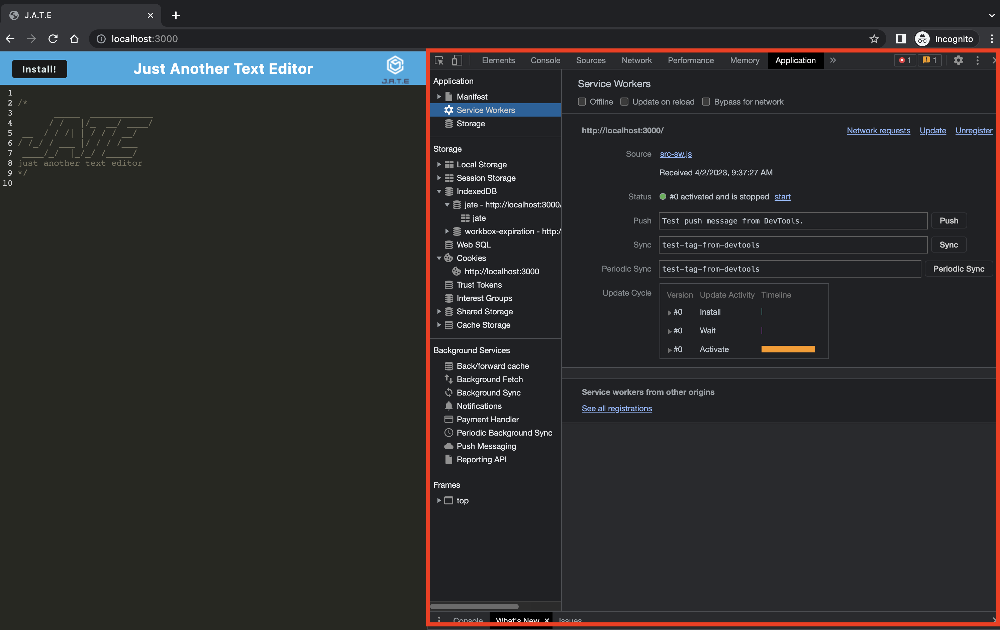

# Andrew's Progressive Web Applications (PWA): Text Editor

## Table of contents

- [Overview](#overview)
  - [The challenge](#the-challenge)
  - [Screenshot](#screenshot)
  - [Links](#links)
- [My process](#my-process)
  - [Built with](#built-with)
  - [Setup](#setup)
- [Author](#author)

## Overview

### The challenge

The project challenge involves building a single-page application that meets the criteria for a Progressive Web App (PWA). The application will be designed with various data persistence techniques to ensure redundancy, in the event that one option is not supported by the user's browser. A key feature of this app will be its ability to function offline, ensuring seamless user experience regardless of connectivity.

### Screenshot

|  |
| :-------------------------------: |
|        _↑ App Overview ↑_         |

|  |
| :-------------------------------: |
|       _↑ Service Workder ↑_       |

|  |
| :-------------------------------: |
|          _↑ IndexedDB ↑_          |

### Links

- GitHub URL: [GitHub Repo](https://github.com/Andrew-TechMaster/Andrew-UWBootcampChallenge-15-PWA-TextEditor)
- Live Site URL: [https://banana-cupcake-09257.herokuapp.com/](https://banana-cupcake-09257.herokuapp.com/)

## My process

### Built with

- express
- webpack
- idb

### Setup

> To install dependencies, run "npm i" and then start the application with "npm run start"

## Author

Andrew (Sheng-Chu), Chou

- Website - [Andrew Chou](https://andrew-techmaster.github.io/Andrew-UWBootcamp-Challenge-02/)
- GitHub - [Andrew-TechMaster](https://github.com/Andrew-TechMaster)

© 2023 edX Boot Camps LLC. Confidential and Proprietary. All Rights Reserved.
